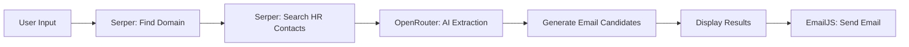

<div align="center">

# ⚡ TalentTrace

### AI-Powered HR Contact Finder & Email Outreach Tool

[](https://reactnative.dev)
[](https://expo.dev)
[](/)
[](/)

**Find HR contacts at any company in seconds — powered by Google Search + AI extraction.**

*No database. No scraping. Just smart search + LLM intelligence.*

---

[🚀 Getting Started](#-getting-started) •
[⚙️ How It Works](#️-how-it-works) •
[🏗️ Architecture](#️-architecture) •
[📱 Screenshots](#-screenshots) •
[🔑 API Keys](#-api-keys-setup)

</div>

---

## 🎯 What is TalentTrace?

TalentTrace is a **cross-platform mobile & web application** that helps job seekers find and contact HR professionals at target companies. Instead of manually googling for hiring managers and guessing email formats, TalentTrace automates the entire pipeline:

```
🔍 Search Company → 🤖 AI Extracts Contacts → 📧 Send Personalized Emails
```

### ✨ Key Features

| Feature | Description |
|---------|-------------|
| 🔍 **Smart Search** | Finds company domains and HR contacts via Serper (Google Search API) |
| 🤖 **AI Extraction** | Uses OpenRouter LLMs (Gemini 2.5 Flash) to intelligently parse search results |
| 📧 **One-Tap Email** | Send emails directly through EmailJS — no backend needed |
| 🔗 **LinkedIn & Phone** | Extracts LinkedIn profile URLs and phone numbers when available |
| 🌙 **Dark Mode** | Auto-detects system theme with a beautiful dark/light UI |
| 📱 **Cross-Platform** | Runs on iOS, Android, and Web from a single codebase |
| 🔒 **Secure Storage** | API keys stored via `expo-secure-store` (Keychain/Keystore) |
| ⚡ **Optimized API Usage** | Only 2 Serper calls + 1 LLM call per search |

---

## ⚙️ How It Works

TalentTrace follows a **3-stage pipeline** for each search:

### Stage 1: Domain Discovery
```
User types "Zomato"
    ↓
Serper API: "Zomato company official website"
    ↓
Extracts: zomato.com
```

### Stage 2: HR Contact Search + AI Extraction
```
Serper API: "zomato.com HR manager recruiter talent acquisition email contact linkedin phone"
    ↓ (10 search results)
OpenRouter API (Gemini 2.5 Flash):
    ↓ Parses snippets, extracts structured data
    {
      domain: "zomato.com",
      patterns: ["firstname.lastname"],
      contacts: [
        { name: "Radhika B.", role: "HR Manager", linkedin: "..." },
        { name: "Ananya J.", role: "Recruiter", email: null },
        ...max 5 contacts
      ]
    }
```

### Stage 3: Email Generation & Outreach
```
Pattern "firstname.lastname" + domain "zomato.com"
    ↓
Generated: radhika.badyal@zomato.com
    ↓
User taps "Send Email" → EmailJS sends it (no backend!)
```

---

## 🏗️ Architecture

```
hr-email-finder/
├── app/                    # Expo Router pages
│   ├── _layout.jsx         # Root layout + auth guard
│   ├── index.jsx           # Main search screen
│   ├── setup.jsx           # 2-page onboarding wizard
│   └── settings.jsx        # API keys + model config
├── components/             # Reusable UI components
│   ├── EmailCard.jsx       # Contact card with email/LinkedIn/phone
│   ├── SearchBar.jsx       # Animated search input
│   ├── Toast.jsx           # Toast notification system
│   └── ProgressSteps.jsx   # Search progress indicator
├── services/               # Business logic layer
│   ├── extractor.js        # OpenRouter API integration + JSON parsing
│   ├── search.js           # Serper API (domain + HR contact search)
│   ├── mailer.js           # EmailJS integration
│   └── storage.js          # Secure key storage + AsyncStorage settings
├── hooks/                  # Custom React hooks
│   ├── useSearch.js        # Full search pipeline orchestration
│   └── useSettings.js      # Settings state management
└── constants/              # App-wide constants
    ├── theme.js            # Dark/light theme system
    └── prompts.js          # AI system prompt + extraction templates
```

### 🔄 Data Flow



### 🔧 Tech Stack

| Layer | Technology | Purpose |
|-------|-----------|---------|
| **Framework** | React Native + Expo 55 | Cross-platform UI |
| **Router** | Expo Router | File-based navigation |
| **Search API** | Serper.dev | Google Search results |
| **AI/LLM** | OpenRouter (Gemini 2.5 Flash) | Contact extraction from text |
| **Email** | EmailJS | Client-side email sending |
| **Storage** | Expo SecureStore + AsyncStorage | Encrypted keys + settings |
| **Styling** | React Native StyleSheet | Dark/light theming |

---

## 🔑 API Keys Setup

TalentTrace requires **2 mandatory** and **4 optional** API keys — all have free tiers:

| Service | Required? | Free Tier | Get Key |
|---------|-----------|-----------|---------|
| **Serper** | ✅ Yes | 2,500 searches | [serper.dev](https://serper.dev) |
| **OpenRouter** | ✅ Yes | Pay-per-use (very cheap) | [openrouter.ai](https://openrouter.ai) |
| **EmailJS** | ❌ Optional | 200 emails/month | [emailjs.com](https://emailjs.com) |

> **💡 Cost Estimate:** Each company search uses ~2 Serper credits + ~800 tokens via OpenRouter. At typical rates, that's **less than $0.001 per search**.

---

## 🚀 Getting Started

### Prerequisites
- Node.js 18+
- npm or yarn
- Expo CLI (`npm install -g expo-cli`)

### Installation

```bash
# Clone the repository
git clone https://github.com/yourusername/hr-email-finder.git
cd hr-email-finder

# Install dependencies
npm install

# Start the development server
npx expo start

# Run on specific platform
npx expo start --web      # Web browser
npx expo start --android  # Android device/emulator
npx expo start --ios      # iOS simulator
```

### First Run Setup

On first launch, you'll see a **2-step setup wizard**:

1. **Page 1** — Enter your Serper and OpenRouter API keys
2. **Page 2** — (Optional) Configure EmailJS for email sending

After setup, you can modify keys and the AI model anytime in **Settings**.

---

## 📱 Usage

1. **Search** — Type any company name (e.g., "Google", "Zomato", "Netflix")
2. **Wait** — The 3-stage pipeline runs (~5-10 seconds)
3. **Browse** — View up to 5 HR contacts with roles, LinkedIn, and phone
4. **Email** — Tap "Send Email" to reach out directly

---

## 🤖 AI Model Configuration

TalentTrace uses **OpenRouter** as an AI gateway, defaulting to `google/gemini-2.5-flash-lite`. You can change the model in Settings by entering any OpenRouter-compatible model ID:

**Recommended Models:**
| Model | ID | Cost |
|-------|----|------|
| Gemini 2.5 Flash Lite | `google/gemini-2.5-flash-lite` | ~$0.0001/search |
| Gemini 2.5 Flash | `google/gemini-2.5-flash` | ~$0.0003/search |
| Llama 3.3 70B | `meta-llama/llama-3.3-70b-instruct:free` | Free* |

> \* Free models require enabling privacy toggles at [openrouter.ai/settings/privacy](https://openrouter.ai/settings/privacy)

---

## 🛠️ API Optimization

TalentTrace is designed to minimize API usage:

| Optimization | Detail |
|-------------|--------|
| **2 Serper calls/search** | 1 for domain, 1 for HR contacts (combined query) |
| **~800 tokens/search** | AI limited to 5 contacts with compact JSON schema |
| **Truncation recovery** | Salvages partial AI responses if cut short |
| **Smart email patterns** | Generates emails from patterns without extra API calls |
| **No verification API** | Emails are generated client-side (domain patterns) |

---

## 🔒 Security

- API keys are stored in **platform-native secure storage** (iOS Keychain / Android Keystore / Web localStorage)
- **No backend server** — all API calls go directly from the client to service providers
- **No data collection** — search results are never stored or transmitted to third parties
- EmailJS private key support for non-browser environments

---

## 📦 Building for Production

```bash
# Build Android APK
eas build --platform android --profile preview

# Build iOS
eas build --platform ios --profile preview

# Build for production
eas build --platform android --profile production
```

---

## 🤝 Contributing

Contributions are welcome! Please feel free to submit a Pull Request.

1. Fork the project
2. Create your feature branch (`git checkout -b feature/AmazingFeature`)
3. Commit your changes (`git commit -m 'Add some AmazingFeature'`)
4. Push to the branch (`git push origin feature/AmazingFeature`)
5. Open a Pull Request

---

## 📄 License

This project is licensed under the MIT License — see the [LICENSE](LICENSE) file for details.

---

<div align="center">

**Built with ❤️ using React Native & Expo**

*Star ⭐ this repo if you found it useful!*

</div>
